# Architecture

This document explains how `faster-llm-inference` is put together: the components, how
data flows between them, and the design decisions behind them. Diagrams use
[Mermaid](https://mermaid.js.org/), which GitHub renders inline.

- [1. Goals](#1-goals)
- [2. System overview](#2-system-overview)
- [3. Module map](#3-module-map)
- [4. The speculative decoding step](#4-the-speculative-decoding-step)
- [5. Lossless verification](#5-lossless-verification)
- [6. Sessions, the pending token and rollback](#6-sessions-the-pending-token-and-rollback)
- [7. Drafters](#7-drafters)
- [8. Training drafters on target traces](#8-training-drafters-on-target-traces)
- [9. Benchmark pipeline (SPEED-Bench style)](#9-benchmark-pipeline-speed-bench-style)
- [10. Cost model](#10-cost-model)
- [11. Production workflow with vLLM](#11-production-workflow-with-vllm)
- [12. Mock server](#12-mock-server)
- [13. Extension points](#13-extension-points)
- [14. Design decisions](#14-design-decisions)

---

## 1. Goals

| Goal | How |
|---|---|
| Show *how* each drafting method works, in code you can step through | Pure-numpy implementations of n-gram, draft-model, EAGLE-style, DFlash/DSpark-style drafters |
| Never trade correctness for speed | One shared verifier implementing exact speculative sampling; tested statistically |
| Explain *when* speculation pays off | SPEED-Bench-style workloads + roofline cost model across draft length and batch size |
| Make real deployments measurable | vLLM config builders, traffic replay client, Prometheus spec-decode metrics |
| Run anywhere | Only dependency is numpy; HTTP via stdlib; mock server for GPU-free end-to-end runs |

Non-goals: being a fast inference engine, or reproducing published speedup numbers.
The toy target model is for mechanisms, not absolute numbers.

---

## 2. System overview

The repo has two halves that share vocabulary and metrics: a **lab** (left), where every
algorithm runs on a toy target, and a **production toolkit** (right), which drives real
vLLM servers.

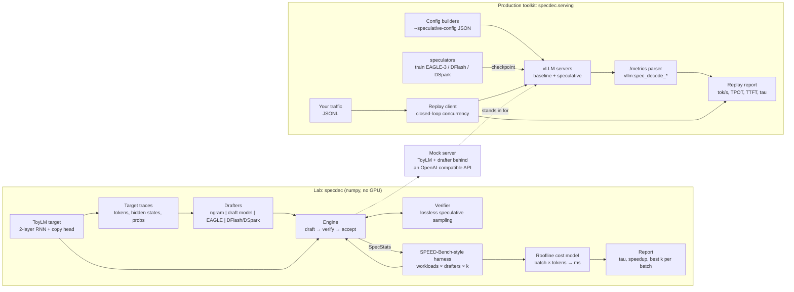

---

## 3. Module map

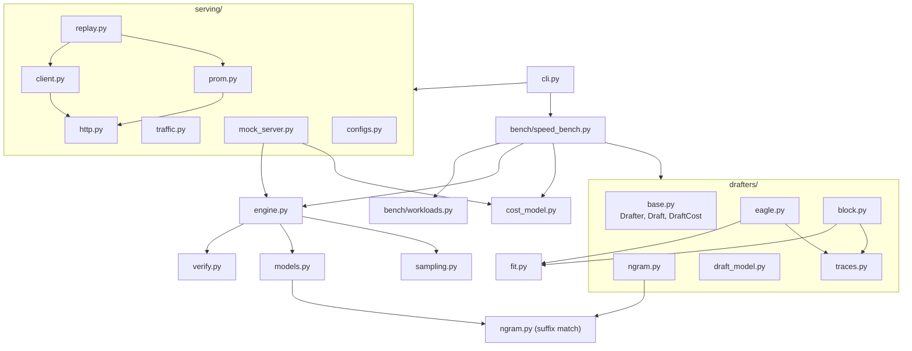

| Module | Responsibility |
|---|---|
| `models.py` | `ToyLM` target (and draft-model factory), `Session` incremental state with rollback |
| `ngram.py` | Longest-suffix n-gram match, shared by the n-gram drafter and the toy target's copy head |
| `verify.py` | `verify_draft`: accept/reject drafts so output ~ target distribution exactly |
| `engine.py` | `speculative_stream` / `speculative_generate` loop; `SpecStats` with vLLM-shaped metrics |
| `drafters/` | One class per method behind the `Drafter` interface; `traces.py` builds training data |
| `fit.py` | Small numpy trainers: ridge, softmax and logistic regression (Adam), truncated SVD |
| `cost_model.py` | Roofline estimate of forward-pass time; converts acceptance into tokens/s and speedup |
| `bench/` | Workload generators (realistic vs synthetic) and the sweep/report pipeline |
| `serving/` | vLLM config builders, streaming client, replay sweeps, `/metrics` parsing, mock server |
| `cli.py` | `specdec` entry point (`demo`, `bench`, `whatif`, `vllm-config`, `replay`, `metrics`, `mock-server`) |

---

## 4. The speculative decoding step

Every step costs one drafting phase plus **one** target forward pass over `[pending, d1..dn]`,
and always emits at least one token.

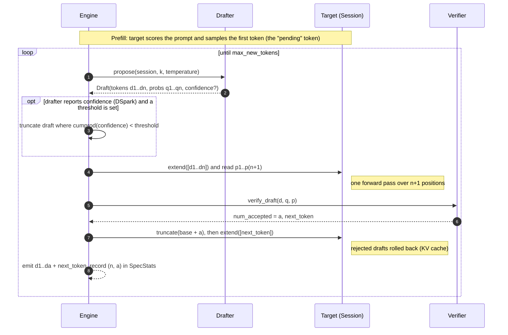

`SpecStats` records exactly what vLLM reports per request: number of steps, drafted and
accepted tokens, the acceptance histogram and per-position acceptance. It also keeps a
per-step log, so one run at `k_max` can be re-scored for any smaller `k`
(`SpecStats.truncated`).

---

## 5. Lossless verification

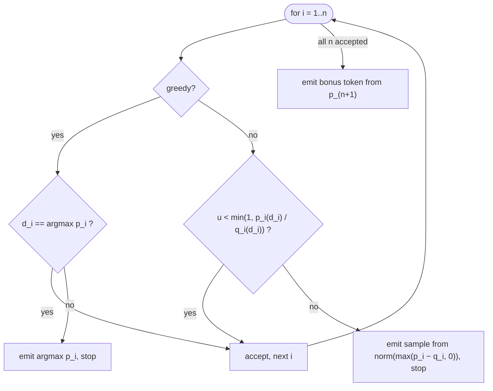

* Deterministic drafters (n-gram) pass `probs=None`. The verifier treats `q_i` as one-hot on
  `d_i`, so acceptance is `p_i(d_i)` and the residual is `p_i` with `d_i` zeroed out.
* Temperature is applied in probability space (`p^(1/T)`, renormalised) for both target and
  drafter before verification. This is valid for mixture models like `ToyLM`.
* `tests/test_verify.py` enumerates every 3-token continuation of a small target and checks
  that the empirical distribution under speculation matches the exact target distribution.

---

## 6. Sessions, the pending token and rollback

`Session` is the toy KV cache: it stores per-token hidden states and supports
`extend`, `truncate` and `sync` (reuse the longest common prefix).

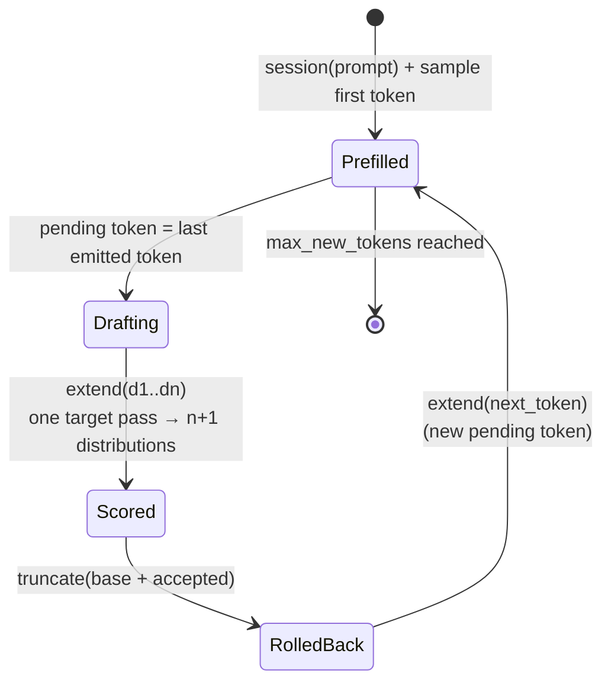

**The pending-token rule.** After each step, the newly emitted token has been *sampled*,
but a real target has not yet run a forward pass on it. That happens at the start of the
next verification pass. The toy session has computed its state already, so drafters that
reuse target hidden states (EAGLE, DFlash/DSpark) must read features only up to
`session.states[-2]` and take the pending token as an input embedding. Otherwise the first
draft token would be "free", and acceptance would be inflated in a way that cannot happen
in vLLM.

```
tokens:   ... x_(t-1)   x_t (pending)  | d1  d2  d3 ...
features: ... f_(t-1)  [not yet real]  |
               ▲           ▲
               │           └── drafter input: embedding(x_t)
               └────────────── drafter input: target features (EAGLE / DFlash anchor)
```

---

## 7. Drafters

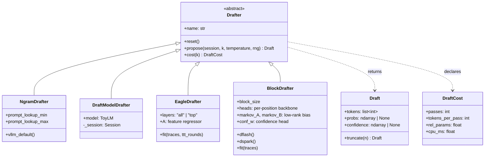

| Drafter | Mirrors vLLM `method` | Proposal | Draft passes per step | Learns from target |
|---|---|---|---|---|
| `NgramDrafter` | `ngram` | tokens after the longest earlier match of the suffix | 0 (CPU only) | nothing |
| `DraftModelDrafter` | `draft_model` | small LM sampled autoregressively | k | (pre-trained, same family) |
| `EagleDrafter(layers="top")` | `eagle` | extrapolate top-layer features, decode with target LM head | k | hidden states |
| `EagleDrafter(layers="all")` | `eagle3` | same, with fused multi-layer features + training-time test | k | hidden states (all layers) |
| `BlockDrafter.dflash` | `dflash` | whole block from one anchored pass | 1 | hidden states + tokens |
| `BlockDrafter.dspark` | `dspark` | block + Markov correction + confidence | 1 | hidden states + tokens + acceptance |

### 7.1 N-gram (prompt lookup)

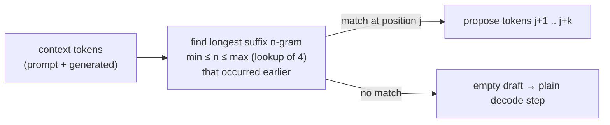

### 7.2 EAGLE-style feature head

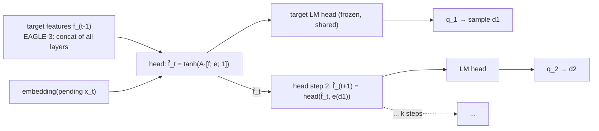

Training (`EagleDrafter.fit`): ridge regression from `[f_(t-1), e(x_t)]` to `atanh(f_t)`
on target traces. With `ttt_rounds > 0` it adds samples whose inputs are the head's
*own* multi-step predictions ("training-time test"), so it learns to correct its own drift.

### 7.3 DFlash / DSpark block drafting

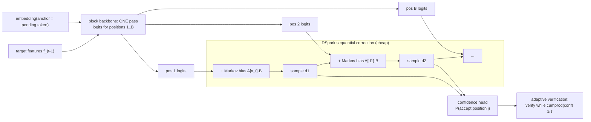

* **DFlash**: Markov rank 0, no confidence. Positions are independent given the anchor, so
  acceptance decays along the block.
* **DSpark**: low-rank Markov head (residual softmax regression on the previous token,
  factored by SVD) plus a logistic confidence head. The engine's `confidence_threshold`
  implements adaptive verification.

---

## 8. Training drafters on target traces

Real drafters are trained on **on-policy** data: responses generated by the target, with
the target's hidden states. `speculators` extracts these from vLLM. The lab does the
same thing in miniature:

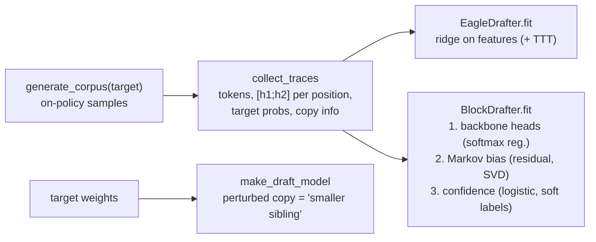

---

## 9. Benchmark pipeline (SPEED-Bench style)

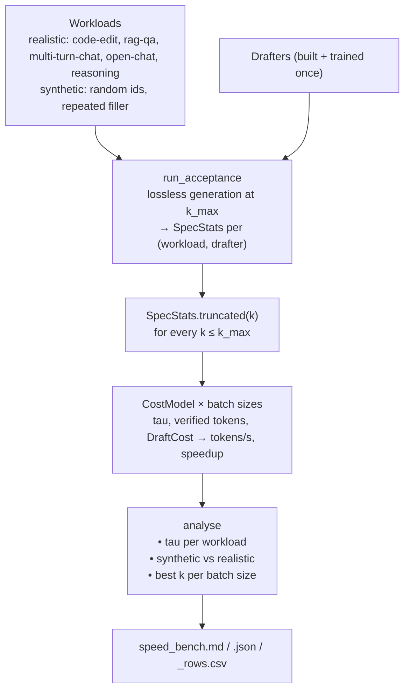

Two-stage by design: **acceptance** depends on the model and the text, not the hardware.
**Throughput** depends on hardware and batch size. Keeping them separate lets one
acceptance run be re-priced for any GPU, model size or batch size.

---

## 10. Cost model

```
forward_ms(B, n) = overhead + max( (weight_bytes + B·ctx·kv_bytes) / HBM_bw ,
                                    2·params·B·n / (peak_flops·mfu) )

speculative step = spec_overhead + draft_ms(B, DraftCost) + forward_ms(B, verified_tokens)
speedup          = (B · tau / step) / (B / forward_ms(B, 1))
```

```
 time per
 target pass      memory-bound                 │ compute-bound
     ▲            (verifying k+1 ≈ verifying 1)│ (each extra token costs FLOPs)
     │                                         │            ╱ n = k+1 tokens
     │                                         │          ╱
     │                                         │        ╱
     │━━━━━━━━━━━━━━━━━━━━━━━━━━━━━━━━━━━━━━━━━┿━━━━━━╱━━━━━ n = 1 token
     │                                         │    ╱
     └─────────────────────────────────────────┴──────────────────► batch size
              speculation ≈ free here                long drafts waste compute here
```

This is why the best `k` falls as batch grows (`tests/test_cost_model.py::test_best_k_shrinks_with_batch`),
and why speedups quoted at concurrency 1 shrink at higher concurrency. KV-cache reads are
per step, not per token, so at large batch and long context speculation also amortises
KV traffic, which partially offsets the compute penalty.

Profiles: `HARDWARE` (H100, A100, L40S, B200) and `MODELS` (8B, 70B, 30B-A3B MoE) in
`cost_model.py`. Use `specdec whatif` to explore them.

---

## 11. Production workflow with vLLM

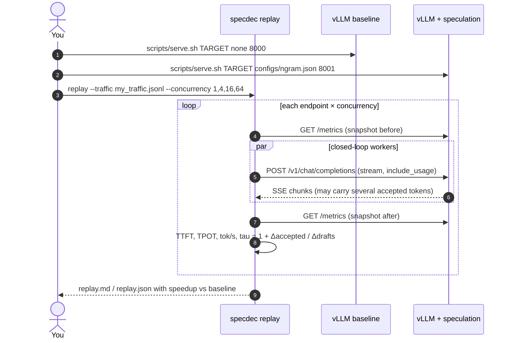

Notes:

* **TPOT, not chunk gaps.** With speculation, one SSE chunk can contain several tokens.
  The client asks for `usage` in the stream and computes
  `TPOT = (latency − TTFT) / (tokens − 1)`.
* **Closed-loop concurrency.** N workers each keep exactly one request in flight, matching
  `--max-concurrency` in vLLM's benchmark tooling.
* **Acceptance on exactly this traffic.** Prometheus counters are diffed around each run.

Training your own drafter (resource #4) slots in at the left: `speculators` produces a
self-describing checkpoint that `vllm serve <checkpoint>` picks up with no extra flags.
See [training-drafters.md](training-drafters.md).

---

## 12. Mock server

`specdec mock-server` wraps the lab engine in an OpenAI-compatible HTTP server so the whole
production workflow can be exercised without a GPU, in CI and in `scripts/local_demo.sh`.

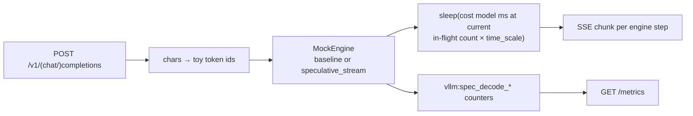

---

## 13. Extension points

| To add... | Do this |
|---|---|
| A drafter | Subclass `Drafter`, implement `propose` (return tempered `probs` you actually sampled from, or `None` if deterministic) and `cost`. Register it in `bench/speed_bench.py::build_drafters`. `tests/test_engine.py` gives you the greedy-equivalence check for free. |
| A workload | Add a `Workload` to `bench/workloads.py::WORKLOADS` with a prompt generator, temperature and output length. |
| Hardware / model profile | Add to `HARDWARE` / `MODELS` in `cost_model.py`; it appears in `--hardware` / `--model-size`. |
| A vLLM method | Add to `serving/configs.py::METHODS`, write a builder, add a JSON under `configs/`. |
| A serving backend | Anything OpenAI-compatible works with `replay`. For metrics, extend `prom.py` with that server's counter names. |

---

## 14. Design decisions

* **numpy only.** Every algorithm runs on a laptop and in CI in seconds, and the code reads
  like the math. GPU work belongs in vLLM and speculators, which this repo drives rather
  than reimplements.
* **One verifier for every method.** Drafters only propose. Losslessness is guaranteed in
  one place and tested once, statistically.
* **Copy head in the toy target.** Real LLMs copy from context (induction heads). Without
  this, n-gram drafting would look useless and code-edit/RAG workloads would be unrealistic.
* **Pending-token rule.** Feature-based drafters cannot see the target's state for the token
  that was just sampled, as in a real engine (see §6).
* **Acceptance and throughput are separate stages.** The prefix-truncation estimator re-scores
  one `k_max` run for every smaller `k`. This holds because verifying a prefix of a draft
  depends only on that prefix.
* **Stdlib HTTP, proxy-free.** `http.client` streams SSE line by line and reaches local
  servers directly, with nothing extra to install.
