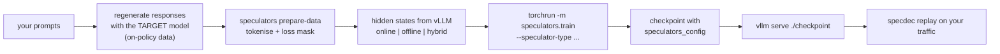

# Training your own drafter

Resource #4: [vllm-project/speculators](https://github.com/vllm-project/speculators) trains
draft models that deploy straight into vLLM. This page summarises the pipeline (following
the speculators *Train a Speculator* tutorial) and maps each step to its miniature
counterpart in the lab.

## Why train one

A generic draft model or a public EAGLE head was trained on generic chat. Acceptance comes
from matching *your* target on *your* traffic. A drafter trained on responses your target
produced for your prompts usually has a higher τ than any off-the-shelf one.

## Algorithms

| `--speculator-type` | Drafting | Notes |
|---|---|---|
| (default) `eagle3` | autoregressive, k passes | most mature; start here |
| `peagle` | parallel multi-token prediction across depths | fewer drafting passes than EAGLE-3 |
| `dflash` | whole block in one pass (anchored block diffusion) | cheapest drafting; acceptance decays along the block |
| `dspark` | DFlash + Markov head + confidence head | sequential correction + adaptive verification |
| `mtp` | fine-tunes the verifier's own MTP head | needs a verifier with native MTP layers |

All of them are lossless: verification guarantees target-identical output distributions.

## Pipeline



Runnable version: `examples/04_train_drafter_speculators.sh`
(`ALGO=eagle3|peagle|dflash|dspark TARGET=... DATA=...`). The core commands:

```bash
# 1. data (speculators venv)
speculators prepare-data --model Qwen/Qwen3-8B --data ./target_responses.jsonl \
  --output ./output --max-samples 5000 --seq-length 8192

# 2. verifier for hidden-state extraction (vLLM venv, from a speculators clone)
CUDA_VISIBLE_DEVICES=0,1 python scripts/launch_vllm.py Qwen/Qwen3-8B -- --data-parallel-size 2 --port 8000

# 3. train (online mode shown; DSpark flags)
CUDA_VISIBLE_DEVICES=2,3 torchrun --standalone --nproc_per_node 2 -m speculators.train \
  --verifier-name-or-path Qwen/Qwen3-8B --data-path ./output --save-path ./output/checkpoints \
  --draft-vocab-size 32000 --epochs 5 --total-seq-len 8192 \
  --speculator-type dspark --num-layers 5 --lr 3e-4 --loss-fn '{"ce": 0.1, "tv": 0.9}' \
  --vllm-endpoint http://localhost:8000/v1 --on-missing generate --on-generate delete

# 4. serve: the checkpoint is self-describing
vllm serve ./output/checkpoints/checkpoint_best --port 8001
```

Check the speculators docs for your installed version; flags evolve.

## The same ideas in miniature

| speculators step | lab equivalent |
|---|---|
| regenerate responses with the target | `models.generate_corpus(target, ...)` |
| extract verifier hidden states | `drafters.collect_traces(target, corpus)` → tokens, `[h1; h2]`, target probs |
| EAGLE-3 training (fused layers, test-time-style rollouts) | `EagleDrafter(target, layers="all").fit(traces, ttt_rounds=1)` |
| DFlash training (block heads on anchor + hidden states) | `BlockDrafter.dflash(target, 8).fit(traces)` |
| DSpark Markov head (`--markov-rank`) | `BlockDrafter.dspark(target, 8, markov_rank=32)` |
| DSpark confidence head | `BlockDrafter.fit` step 3 (logistic regression, soft labels) |
| serve + measure | `speculative_generate(...)`, `specdec bench`, `specdec mock-server` |

```python
from specdec import ToyLM, speculative_generate
from specdec.drafters import BlockDrafter, EagleDrafter, collect_traces
from specdec.models import generate_corpus

target = ToyLM()
traces = collect_traces(target, generate_corpus(target, 120, 128))   # on-policy data
eagle3 = EagleDrafter(target).fit(traces, ttt_rounds=1)
dspark = BlockDrafter.dspark(target, block_size=8).fit(traces)

prompt = [5, 17, 42, 9, 77, 3]
r = speculative_generate(target, dspark, prompt, 128, k=8, confidence_threshold=0.3)
print(r.stats.to_dict())
```

## Tips

* **On-policy data matters more than volume.** Train on what the target actually says.
* **Match the sampling regime.** If production runs at temperature 0.7, include sampled
  responses in the training data.
* **Watch per-position acceptance**, not only τ. It tells you which k to serve with.
* **Re-measure after every target change** (fine-tune, quantisation, new chat template).
  A drafter is tied to its verifier.
