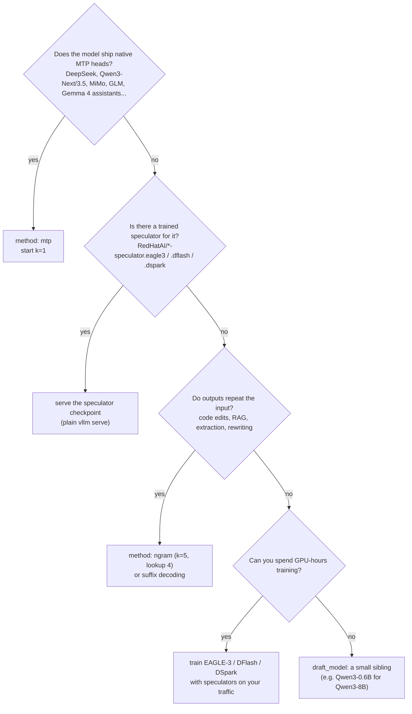

# Serving with speculative decoding in vLLM

How to pick a method and a draft length, and the exact configs. Keys follow the
[vLLM speculative decoding docs](https://docs.vllm.ai/en/latest/features/speculative_decoding/).
Option names change between releases, so pin your vLLM version.

## Pick a method



Always start with n-gram: it is free to try, needs no extra memory, and the replay report
tells you within minutes whether your traffic is copy-heavy enough to benefit.

## Configs

All of these live in `configs/` and can be printed with `specdec vllm-config <method>`.

| Method | `--speculative-config` |
|---|---|
| N-gram (post's starting point) | `{"method": "ngram", "num_speculative_tokens": 5, "prompt_lookup_max": 4}` |
| Suffix decoding | `{"method": "suffix", "num_speculative_tokens": 8}` |
| Draft model | `{"method": "draft_model", "model": "Qwen/Qwen3-0.6B", "num_speculative_tokens": 5}` |
| EAGLE-3 | `{"method": "eagle3", "model": "RedHatAI/Llama-3.1-8B-Instruct-speculator.eagle3", "num_speculative_tokens": 3}` |
| MTP | `{"method": "mtp", "num_speculative_tokens": 1}` |
| DFlash | `{"method": "dflash", "model": "RedHatAI/Qwen3-8B-speculator.dflash", "num_speculative_tokens": 8}` |
| DSpark | `{"method": "dspark", "model": "<dspark speculator>", "num_speculative_tokens": 8}` |

```bash
# online
scripts/serve.sh Qwen/Qwen3-8B configs/ngram.json 8001
# equivalent
vllm serve Qwen/Qwen3-8B --port 8001 \
  --speculative-config '{"method":"ngram","num_speculative_tokens":5,"prompt_lookup_max":4}'

# speculators checkpoints are self-describing
scripts/serve_speculator.sh RedHatAI/Qwen3-8B-speculator.eagle3 8002
```

Offline (`vllm.LLM`):

```python
from vllm import LLM, SamplingParams

llm = LLM(model="Qwen/Qwen3-8B",
          speculative_config={"method": "ngram", "num_speculative_tokens": 5, "prompt_lookup_max": 4})
print(llm.generate(["The future of AI is"], SamplingParams(max_tokens=64))[0].outputs[0].text)
```

## Choose k (`num_speculative_tokens`)

* **Latency-bound (low concurrency):** verification is nearly free, so longer drafts help
  until per-position acceptance gets low. Typical: 3-5 for autoregressive drafters (EAGLE,
  draft model), 5 for n-gram, block size (8+) for DFlash/DSpark.
* **Throughput-bound (high concurrency):** every verified token costs compute; shorten k.
  `specdec bench` shows the best k falling from 8 at batch 1 to 2-4 at batch 256 on the toy
  target. Check per-position acceptance in `/metrics`: positions accepted less than ~30% of
  the time are usually not worth verifying at high load.
* **Load varies:** look at vLLM's dynamic speculative decoding and adaptive verification
  (DSpark's confidence head), which size verification per step or per request.

Quick what-if for your hardware:

```bash
specdec whatif --alpha 0.7 --hardware h100 --model-size 8b --batch-sizes 1,8,32,128
specdec whatif --alpha 0.8 --draft-passes 1 --draft-rel-params 0.1   # block drafter
```

## Checklist

- [ ] Same vLLM version and flags for baseline and speculative servers
- [ ] Replayed real traffic at real concurrency (`specdec replay`)
- [ ] τ and per-position acceptance read from `/metrics` (`specdec metrics`)
- [ ] k re-tuned for peak load, not only for single-stream latency
- [ ] GPU memory checked: draft models and heads need weights and KV cache too
- [ ] Output spot-checked: it should be identical for greedy decoding (lossless)
